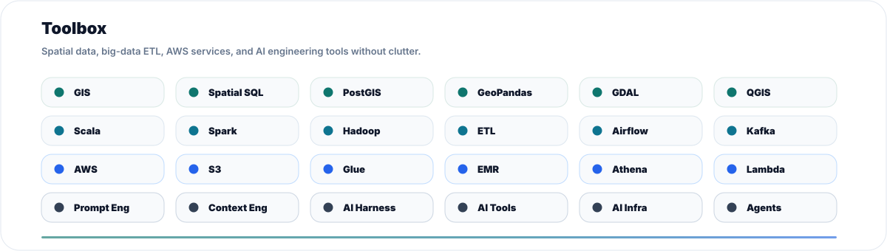

# Shaishav Maisuria

### Geospatial AI, big data engineering, AWS ETL, and AI infrastructure.

  
  
  

I build at the intersection of geospatial intelligence, big-data engineering, AWS data infrastructure, and AI-driven development. My work centers on spatial data systems, ETL pipelines, scalable processing, context engineering, AI harnesses, and practical AI tools that make complex technical workflows easier to run and reason about.

## Brand focus

| Pillar | Direction |
| --- | --- |
| Geospatial intelligence | GIS, spatial data modeling, mapping workflows, and location-aware analytics. |
| Big data and ETL | Scala, Hadoop/Spark-style processing, pipeline design, orchestration, and data quality. |
| AWS data infrastructure | Cloud-native storage, processing, integration, and operational data platforms. |
| AI engineering | AI-driven development, prompt/context engineering, AI harnesses, tools, and infra. |

## Toolbox

## How I work

- I think spatially first: location, scale, topology, time, and data quality all matter.
- I build data systems as repeatable pipelines: ingest, transform, validate, serve, monitor.
- I use AI as engineering infrastructure: prompts, context, tools, evals, harnesses, and automation.

## Connect

I am easiest to reach through [LinkedIn](https://www.linkedin.com/in/shaishav-maisuria/). For a concise background summary, open my [resume](https://drive.google.com/file/d/1Klni1VQr1xGMxMwY8ShntAT614evKUGY/view?usp=sharing).
