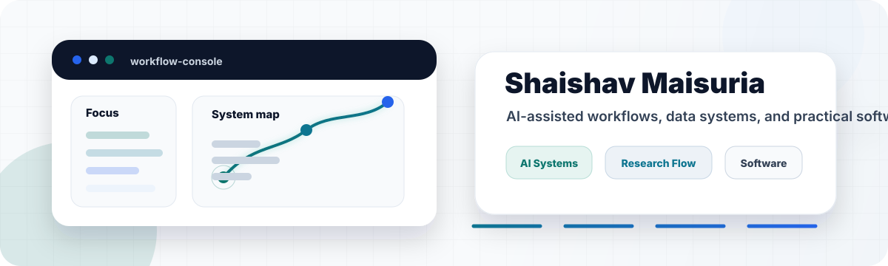
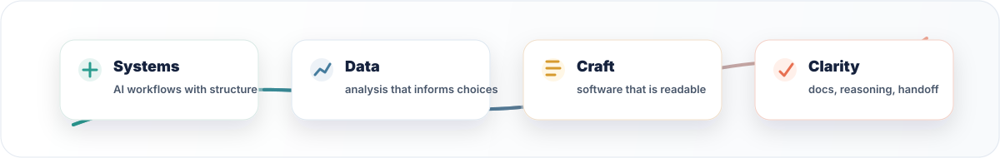

# Shaishav Maisuria

### AI-assisted workflows, data systems, and practical software craft.

  
  
  

I build at the intersection of AI workflows, data-informed engineering, and practical software. My GitHub profile is meant to show a clear professional signal: thoughtful systems, readable implementation, and tools that make complex work easier to understand and use.

## Brand focus

| Pillar | Direction |
| --- | --- |
| AI systems | Designing agent-assisted workflows that keep human judgment in control. |
| Data thinking | Turning messy information into analysis, decisions, and useful feedback loops. |
| Software craft | Writing code that is understandable, maintainable, and easy to build on. |
| Communication | Making technical work easier to explain through docs, structure, and clean handoffs. |

## Toolbox

  
  
  
  
  
  
   
  
  
  
  
  
  
   
  
  
  

## How I work

- I use GitHub as a lab notebook: build, document, revisit, improve.
- I value code that explains the idea, not just code that runs.
- I like work where AI, data, and product thinking meet.

## GitHub snapshot

  
  

## Connect

I am easiest to reach through [LinkedIn](https://www.linkedin.com/in/shaishav-maisuria/). For a concise background summary, open my [resume](https://drive.google.com/file/d/1Klni1VQr1xGMxMwY8ShntAT614evKUGY/view?usp=sharing).
